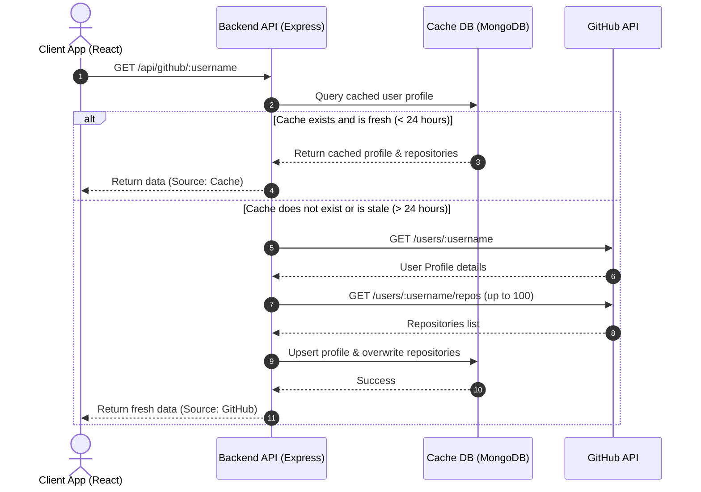

# GitPeek

GitPeek is a full-stack developer dashboard application for exploring GitHub profiles, statistics, and repositories. Built with React, Node.js, Express, and MongoDB, it implements a 24-hour cache synchronization layer to improve page load performance and bypass GitHub API rate limiting controls.

## System Architecture

The following diagram illustrates how the caching layer intercepts developer searches to optimize speed and API usage:



## Key Features

- **Profile Search and Analytics**: Fetches comprehensive developer metadata, including biography, hireable flag, avatars, join dates, and follower metrics.
- **Repository Directory**: Provides drill-down views of stars, forks, open issues, languages, default branches, and repository visibility.
- **24-Hour Caching Engine**: Auto-expires database entries after 24 hours, automatically refreshing profiles on subsequent searches while preserving rate limits.
- **Bookmarking and Favorites**: Allows users to save favorite profiles for quick access, synchronized locally via browser storage.
- **Search History Tracker**: Logs search queries to provide tag-based links to recent profiles.
- **Cache Management**: Provides administrative controls to manually purge specific user records and their repositories from the database.

## Tech Stack

### Frontend
- React 19
- React Router 7
- Vite
- Axios
- React Icons
- Vanilla CSS with CSS Modules

### Backend
- Node.js (ES Modules)
- Express
- MongoDB (Mongoose ODM)
- Axios

### Development Tooling
- Concurrently
- Oxlint Linter
- Nodemon

## Getting Started

### Prerequisites
- Node.js (version 18 or higher recommended)
- MongoDB Community Server (running locally or a remote MongoDB Atlas URI)

### Environment Configuration

#### Backend Configuration
Create a `.env` file in the `server` directory:

```env
PORT=5000
MONGODB_URI=mongodb://localhost:27017/github-explorer
GITHUB_API=https://api.github.com
# GITHUB_TOKEN=your_optional_personal_access_token
```

*Note: Providing a `GITHUB_TOKEN` is optional, but recommended to prevent rate limiting (GitHub limits unauthenticated requests to 60 per hour, while authenticated requests receive up to 5,000 per hour).*

#### Frontend Configuration
Create a `.env` file in the `frontend` directory:

```env
VITE_API_URL=http://localhost:5000/api
```

### Installation and Running

From the root directory of the project, follow these commands:

1. **Install dependencies for both frontend and backend**:
   ```bash
   npm run install-all
   ```

2. **Run both servers in development mode concurrently**:
   ```bash
   npm run dev
   ```

   This launches:
   - The React frontend application at `http://localhost:5173`
   - The Express backend server at `http://localhost:5000`

### Individual Project Scripts

If you wish to run the projects separately:

- **Start backend server only**:
  ```bash
  npm run server
  ```
- **Start frontend server only**:
  ```bash
  npm run frontend
  ```

## API Reference

The backend API is exposed under the `/api` prefix.

| Method | Endpoint | Description |
|:---|:---|:---|
| `GET` | `/api/github/:username` | Resolves a profile, checking the MongoDB cache first. |
| `POST` | `/api/github/refresh/:username` | Forces a fresh synchronization from GitHub, bypassing cache checks. |
| `GET` | `/api/users` | Lists all cached user profiles stored in the database. |
| `GET` | `/api/history` | Lists recently searched usernames (limited to the last 12 unique entries). |
| `DELETE` | `/api/users/:id` | Purges a specific cached user, their repository index, and search logs. |
