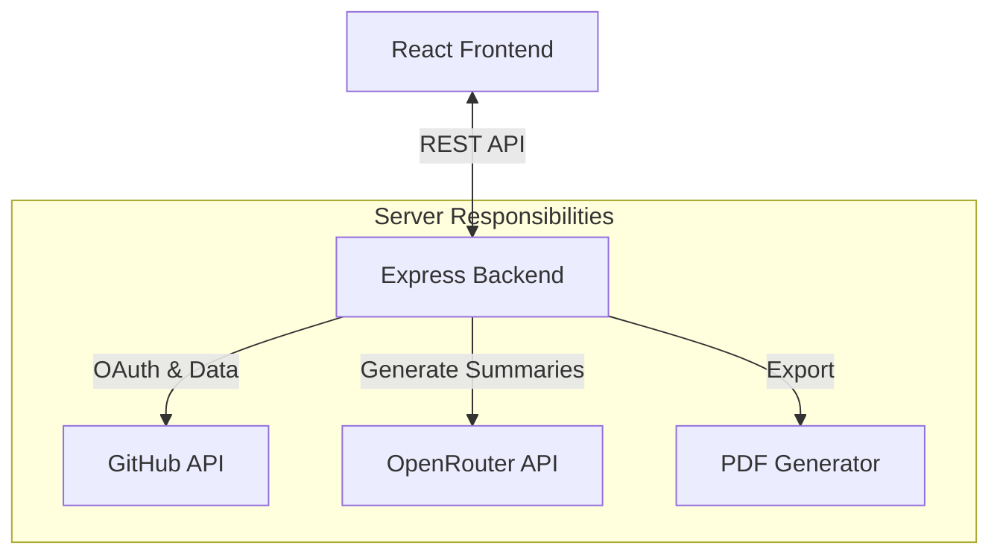
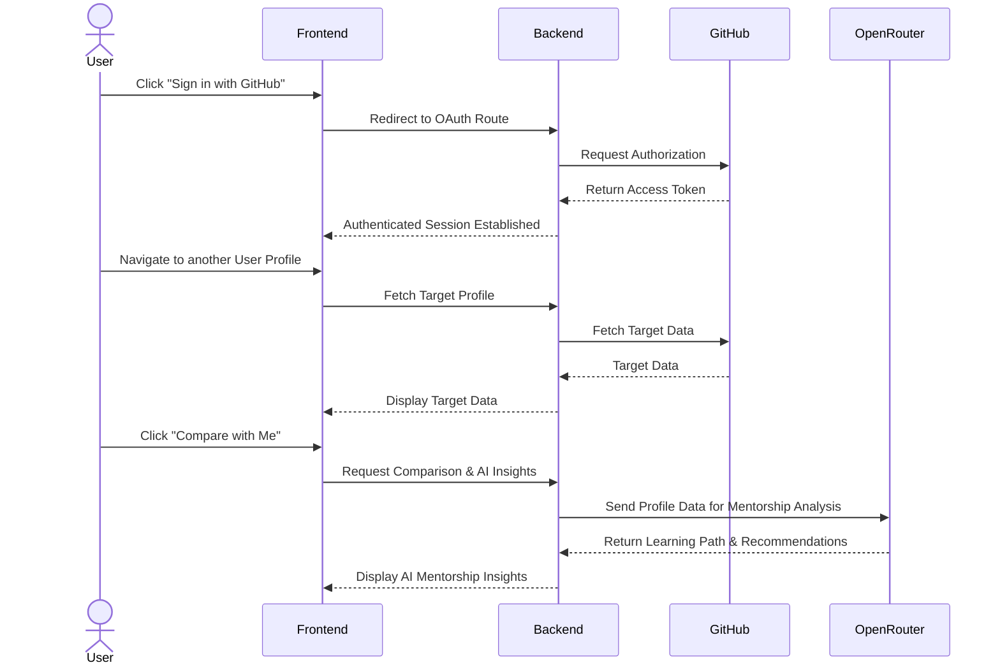

# System Overview

GitPeek is designed as a full-stack, decoupled monorepo application. Its primary goal is to provide a seamless, aesthetically pleasing interface for exploring GitHub user data, comparing profiles, and generating AI-powered insights.

## Architecture

The project is split into two primary domains:

1. **The Frontend Client (`/frontend`)**
2. **The Backend Proxy (`/server`)**

### The Frontend Client
The user interface is a Single Page Application (SPA) built with **React**, bootstrapped via **Vite**. It handles all client-side routing, state management, and user interactions.

- **Data Fetching:** The frontend requests data directly from our local backend server rather than hitting GitHub APIs.
- **State Management:** Handled largely via React Context (e.g., `SearchContext`, `AuthContext`) and local component state.
- **Styling:** CSS Modules are used strictly alongside a set of global CSS tokens to ensure a pristine, encapsulated dark theme.

### The Backend Proxy
The backend is a lightweight Node.js application built with **Express**. Its primary responsibility is to securely proxy requests, handle OAuth, and interact with third-party APIs like OpenRouter.

- **Rate Limit Management:** By injecting a server-side Personal Access Token (PAT) or the user's OAuth token into the proxied requests, the backend bypasses strict unauthenticated rate limits.
- **AI Integration:** Acts as the secure middleware for communicating with the OpenRouter LLM API.
- **PDF Generation:** Handles the generation and streaming of PDF reports.

## High-Level Architecture Flow

## Authentication and Profile Comparison Flow

GitPeek introduces the ability to compare your authenticated GitHub profile against other developers to gain AI-powered mentorship insights.

